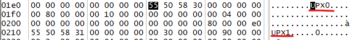
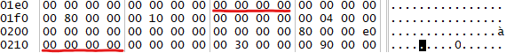

# AntiDebug demonstration 
These files are intended for demonstration of several commonly used AntiDebug techniques. All of this techniques are combined in order to create standard PE file with all of the techqniues in order to demonstrate how to break all of them in single debugging session. 

## Packing and unpacking with UPX 
Because of the bug in current version in UPX, we cannot pack and unpack binary in standard way. 

(https://github.com/upx/upx/issues/75#issuecomment-362878398)

First pack binary with UPX 3.96 
https://github.com/upx/upx/releases/tag/v3.96
```
e:\1.semester\BIT\SemestralnyProjekt\upx-3.96-win64\upx-3.96-win64>upx.exe AllCombined.exe
                       Ultimate Packer for eXecutables
                          Copyright (C) 1996 - 2020
UPX 3.96w       Markus Oberhumer, Laszlo Molnar & John Reiser   Jan 23rd 2020

        File size         Ratio      Format      Name
   --------------------   ------   -----------   -----------
     10240 ->      7680   75.00%    win32/pe     AllCombined.exe                                                                                                                                                                                Packed 1 file.

```

Copy packed file to folder with UPX 2.90. 


Then, unpack it with UPX 2.90 
https://sourceforge.net/projects/upx/files/upx-beta/2.90/upx290w.zip/download
```
e:\1.semester\BIT\SemestralnyProjekt\upx290w\upx290w>upx.exe -d AllCombined.exe
                       Ultimate Packer for eXecutables
    Copyright (C) 1996,1997,1998,1999,2000,2001,2002,2003,2004,2005,2006
UPX 2.90w       Markus Oberhumer, Laszlo Molnar & John Reiser    Oct 8th 2006

        File size         Ratio      Format      Name
   --------------------   ------   -----------   -----------
     10240 <-      7680   75.00%    win32/pe     AllCombined.exe

Unpacked 1 file.

```

## Modifying packed binary so it is not posible to automaticly unpack it with UPX 
As far as anti-debug teqnique with UPX goes, we did not crete a concrete obstacle for person anlyzing our program. Going past UPX packed binary, is as easy as running single command. But we can modify binary with hex editor. Our goal is to modify the header section of binary packed with UPX, so it thinks our binary is corupted and therfore UPX won't be able to decompress it. 

- first we have to identify UPX header in our packed binary:



- then, modify the header:



After tempering with UPX header, binary is still fully functional. But UPX is not able to decompress it with ``-d`` flag: 

```
e:\1.semester\BIT\SemestralnyProjekt\upx290w\upx290w>upx.exe -d AllCombined.exe
                       Ultimate Packer for eXecutables
    Copyright (C) 1996,1997,1998,1999,2000,2001,2002,2003,2004,2005,2006
UPX 2.90w       Markus Oberhumer, Laszlo Molnar & John Reiser    Oct 8th 2006

        File size         Ratio      Format      Name
   --------------------   ------   -----------   -----------
upx: AllCombined.exe: CantUnpackException: file is modified/hacked/protected; take care!!!

Unpacked 0 files.
```
